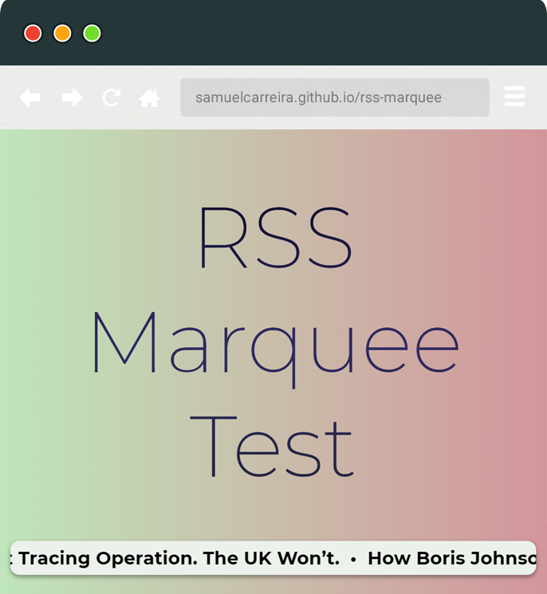

# RSS Marquee
Scrolling text like the old &lt;marquee> tag with a customizable RSS feed - Simple code written in Vanilla JS



### Test it here: https://samuelcarreira.github.io/rss-marquee

### Note
I shared the code that I wrote for an older project because it can be useful to someone (just browse the JS class written). So this repository doesn't pretend to be some kind of library or anything complex.

## Key Features
* **Pure / vanilla JavaScript (no jQuery)**
* **Multiple RSS feed sources (for fallback)**
* **Compatible with the most recent browsers**
* **Uses CSS animations (for performance)**

## Quick Usage
Download the `rss-marque.js` script file and declare the `RSSMarquee` Class
```
<body>
    <div id="marquee"></div>

    <script src="rss-marquee.js"></script>

    <script>
        document.addEventListener('DOMContentLoaded', () => {

            const feedUrl = ['https://www.dnoticias.pt/rss/home.xml', 'https://cors-anywhere.herokuapp.com/https://www.buzzfeed.com/world.xml'];

            const elementSelector = document.getElementById('marquee');

            new RSSMarquee(feedUrl, elementSelector);
        });
    </script>
</body>
```

## RSSMarquee(feedURLs, elementContainer, options)

### Class options
Property         | Type     | Required    | Description
---------------- | -------- | ---------- | ----------------------
`feedURLs`  | `string[]` | yes     | List of RSS Feed URLs
`elementContainer`  	 | `HTMLelement` | yes   | the selector of the marquee container
`options.speed`  	 | `number` | no | Duration in ms per character. Bigger values = slow speed. Value between 50-300. Default value: 110
`options.maxItems`  	 | `number` | no | specify max number of titles to show (useful to debug: not wait for all titles before goes to the next feed)
`options.hostnameSelector`  	 | `HTMLelement` | no | The selector of the element where you want to show the URL of the news feed source (usefull for copyright atttribution)

## Motivation and history
I've created this code because I needed a news feed scrolling text on a client project. After a quick search, I found some solutions, but none completely satisfies me. I didn't want to use jQuery and many libraries depend on it. Also, I want to make it at lean as possible and to take advantage of recent browser technologies with graphic acceleration, so I ditched all alternatives who use the `setInterval` function to set the animation time.

## How it works
1. The XML feed is fetched using the native `fetch API`
2. The XML is parsed to extract all the titles
3. The titles are processed (remove HTML tags and invalid characters)
4. The container element is animated with the `translateX` CSS function
5. After the animation ends (with the `onfinish` event), the library fetches the next feed

## License
- **[MIT license](http://opensource.org/licenses/mit-license.php)**
- Copyright 2020 © <a href="http://samuelcarreira.com" target="_blank">Samuel Carreira</a>.
